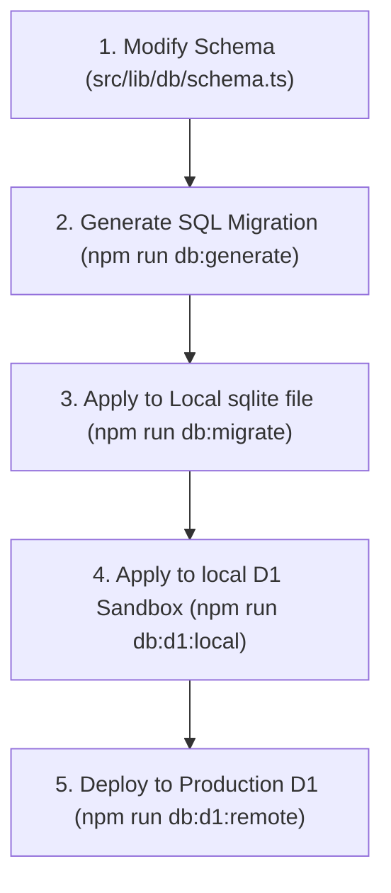

# 🗄️ Hangout Database Management & Schema Guide

This guide details the database architecture, schema definitions, migration procedures, and command recipes for managing both the local development SQLite databases and the remote Cloudflare D1 production database.

---

## 🏗️ Database Architecture & Environments

Hangout operates in three database environments depending on the context:

| Environment | Database Target | Connection Driver | Config / Binding |
| :--- | :--- | :--- | :--- |
| **Local Next.js Dev** | `./local.db` (SQLite file) | `better-sqlite3` | `DB_LOCAL_PATH` (defaults to `./local.db`) |
| **Local D1 Sandbox** | Wrangler D1 Local Database | `@cloudflare/mini-oxygen` | Bound to `env.DB` under local wrangler env |
| **Production Cloudflare D1** | Remote Cloudflare D1 Instances | D1 Native Binding | Database ID: `934962ed-7fb8-4338-9120-69df5957722d` |

> [!NOTE]
> For Next.js dev server runs, Drizzle falls back to the local SQLite file `./local.db`. 
> When deployed or run inside Cloudflare's runtime (e.g. `next-on-pages` / Pages dev / wrangler), Drizzle connects directly to the native D1 binding (`env.DB`).

---

## 🔄 The Schema Migration Workflow

When updating or modifying the database, always follow this step-by-step lifecycle:



### Step 1: Modify the Schema
Open and edit the definitions in [schema.ts](file:///c:/Users/abhis/Documents/GitHub/hangoutt/src/lib/db/schema.ts).

### Step 2: Generate Migration SQL Files
Drizzle Kit will diff your TypeScript schema against current snapshots and output the raw SQL file inside `drizzle/migrations/`:
```bash
npm run db:generate
```

### Step 3: Sync Your Local sqlite file
Apply the generated SQL files to the local SQLite `./local.db` used by `next dev`:
```bash
npm run db:migrate
```

### Step 4: Sync Wrangler D1 Local Sandbox
Wrangler maintains its own local SQLite database instances for local server tests. Keep it in sync by running:
```bash
npm run db:d1:local
```

### Step 5: Sync Cloudflare D1 Production
Apply migrations to the remote, live production D1 database on Cloudflare:
```bash
npm run db:d1:remote
```

---

## 🛠️ Database Management Command Reference

Use these NPM scripts defined in `package.json` to manage the database:

| NPM Script | Command Executed | Purpose |
| :--- | :--- | :--- |
| `npm run db:generate` | `drizzle-kit generate` | Diff schema and generate migration SQL files. |
| `npm run db:migrate` | `tsx src/lib/db/migrate.ts` | Apply pending migrations to local sqlite file (`./local.db`). |
| `npm run db:push` | `drizzle-kit push` | Push schema changes directly without generating migrations (Use with caution!). |
| `npm run db:studio` | `drizzle-kit studio` | Launch visual browser GUI inspector at `https://local.drizzle.studio` (for `./local.db`). |
| `npm run db:d1:local` | `wrangler d1 migrations apply hangout-dev --local` | Run migrations on wrangler's local mock D1 instance. |
| `npm run db:d1:remote` | `wrangler d1 migrations apply hangout-dev --remote` | Deploy migrations directly to production D1 database on Cloudflare. |

---

## 🔍 CLI Query Recipes & DB Inspection

You can execute raw SQL commands directly from your terminal using Wrangler's CLI. This is highly useful for inspecting tables, verifying schema integrity, and checking data.

### Querying Local D1 Sandbox
To inspect the local miniflare SQLite database:
```bash
# Get the first 5 synced users
npx wrangler d1 execute hangout-dev --local --command "SELECT id, email, name FROM users LIMIT 5;"

# Check available groups
npx wrangler d1 execute hangout-dev --local --command "SELECT id, name, group_type FROM groups;"

# Count how many experiences are in the database
npx wrangler d1 execute hangout-dev --local --command "SELECT COUNT(*) as count FROM experiences;"
```

### Querying Production D1
To inspect the live remote database:
```bash
# Get the first 5 synced users
npx wrangler d1 execute hangout-dev --remote --command "SELECT id, email, name FROM users LIMIT 5;"

# See active generated plans
npx wrangler d1 execute hangout-dev --remote --command "SELECT id, name, tagline, budget_tier FROM plans LIMIT 5;"

# Inspect schema migrations status on remote
npx wrangler d1 execute hangout-dev --remote --command "SELECT * FROM d1_migrations;"
```

---

## ⚠️ SQLite & D1 Specific Gotchas

### 1. Dropping / Renaming Columns
SQLite does not natively support many `ALTER TABLE` statements (like dropping or changing column constraints). To achieve this, Drizzle-Kit automatically creates a migration that:
1. Creates a temporary table with the new structure.
2. Copies data from the old table to the temporary table.
3. Drops the old table.
4. Renames the temporary table back to the original name.

> [!WARNING]
> If a column's name is changed, the auto-generated migration might fail because it attempts to select the new column name from the old table.
> Always manually inspect generated migrations in `drizzle/migrations/` to verify the mapping (e.g. `INSERT INTO new_table SELECT NULL AS new_col, old_col AS another_col FROM old_table;`).

### 2. Interactive Prompts in Non-Interactive Shells
When renaming fields, Drizzle-Kit prompts the user in the CLI: `"Did you rename column X to Y?"`.
In non-interactive environments (like automated CI/CD runners), this prompt blocks execution and fails.
* **Workaround**: Introduce new fields as independent additions first, deprecate old fields instead of renaming them instantly, and use code migration patterns to shift records safely.

### 3. WAL Mode Optimization
For local Better-SQLite3 instances, the connection has WAL (Write-Ahead Logging) and Normal Synchronous settings enabled in [client.ts](file:///c:/Users/abhis/Documents/GitHub/hangoutt/src/lib/db/client.ts) to maximize write throughput and concurrent read performance:
```typescript
sqlite.pragma('journal_mode = WAL');
sqlite.pragma('synchronous = NORMAL');
```
If you encounter database lock errors during concurrency-heavy local integration tests, you can temporarily disable WAL mode by removing these pragmas.
